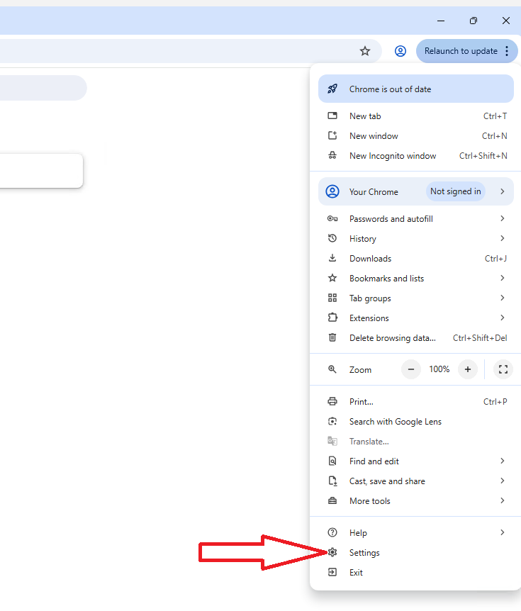
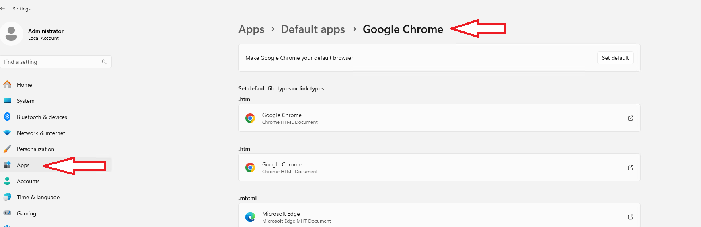

# Post-quantum Crypto (PQC) and F5

Quantum computing is one of today's most exciting technological advancements, poised to transform industries with its unparalleled processing power. Unlike classical computers, which encode data using binary bits (zeroes and ones), quantum computers leverage quantum bits, or qubits. Qubits can exist in a superposition of zero and one, meaning they can be a zero, a one, or a combination of both at the same time. This capability enables quantum computers to solve certain types of problems exponentially faster than today's classical computers.

While quantum computing won't necessarily benefit everyday tasks like web surfing, its true strength lies in addressing complex, data-intensive challenges, such as accelerating medical and pharmaceutical research, optimizing AI algorithms, improving network designs, and advancing cryptography.

PQC's key benefits include future-proofing data security against powerful quantum computers, ensuring long-term data confidentiality (defeating "harvest now, decrypt later"), enabling seamless migration with hybrid modes, meeting regulatory compliance, and providing enhanced authentication and data protection for critical systems like finance, government, and communications, all while maintaining compatibility with current infrastructure.  

Cryptography is embedded into the core of the F5® Application Delivery and Security Platform (ADSP) via the F5 BIG-IP® Traffic Management Microkernel (TMM), a foundational element of BIG-IP solutions. 

F5 ADSP plays a pivotal role in network and application architectures by managing traffic between clients and servers. As a result, it is strategically positioned to facilitate PQC readiness and adapt seamlessly to evolving encryption standards.

NGINX provides PQC support using the Open Quantum Safe provider library for OpenSSL 3.x (oqs-provider). This library is available from the Open Quantum Safe (OQS) project. The oqs-provider library integrates the post-quantum algorithms from the OQS project into network protocols (e.g., TLS) for applications that use OpenSSL 3. All ciphers/algorithms provided by oqs-provider are supported by NGINX. 

[F5 Post-quantum cryptography readiness](https://www.f5.com/pdf/solution-overview/f5-pqc-readiness.pdf)

[Understanding PQC Standards and Timelines](https://www.f5.com/company/blog/understanding-pqc-standards-and-timelines)

<br>

## Lab Environment

This lab environment contains three parts:

- BIG-IP Version 17.5.1.3.0.0.19
- NGINX Open Source Server
- Windows-client


### Windows-client

From the Windows-client we will be able to access the BIG-IP TMUI, NGINX, and the websites protected with PQC profiles/OpenSSL.

1. Navigate to the details button of the Windows-client. Select either RDP or Console to access the Windows-client.
    - MAC users should connect with RDP 
    - Windows users should connect using the Console
 
> Note: For RDP, select the appropriate resolution format -- This will initiate the rdp file download which then can be used to access the Windows-client.

> Note: To run the RDP session in "windowed" mode, choose a screen size from the drop-down list


2. Windows-client admin credentials - **uQpLYwsLUrsyz**


3. Accept the RDP certificate error if prompted


4. Open the Chrome browser and skip the sign-in process.  **DO NOT** attempt to reinstall Chrome or finish the update.

> Note: Kyber level PQC was an early access feature in Chrome, it has been removed from the current Chrome release. We will be using an older version of Chrome in  this lab.
<br>


5. Set Chrome as the default browser. This will need to be done in two places, the browser itself and in Windows System properties.  

6. Set Chrome as the default browser in Chrome

  

<br>



<br>

7. Set Chrome as the default browser in Windows System properties - Settings > Apps > Default apps > Google Chrome
<br>


<br>
<br>

### BIG-IP Setup

BIG-IP has version 17.5.1.3.0.0.19 installed. In version 17.1, PQC for client-side SSL profiles was introduced, which we will explore in this lab. In version 17.5.1, PQC for server-side SSL profiles was added, and both client and server-side ciphers were updated to the NIST standards at the time of publication.

BIG-IP supports both Kyber and ML-KEM, in this lab we will demonstrate Kyber, though ML-KEM is more widely adopted.

> Note: We will not demonstrate server-side SSL PQC in this lab; however, the environment supports it, for exploration.  
<br>

1. Log into the BIG-IP to verify access and configuration

    From the Chrome browser, open the BIG-IP TMUI: ```https://10.1.1.6```

    User: admin  
    Password admin
<br>

  
<br>


<br>


<br>
<br>

2. Post-quantum crypto configuration

BIG-IP utilizes SSL Profiles for client and server-side TLS negotiations. Within the SSL Profile, attached cipher groups manage the cipher rules for negotiation.

The BIG-IP Configuration has already been completed for the lab. If you would like to configure and familiarize yourself with a new SSL profile, please use the following knowledge article as a reference: [K000149577: Enable post-quantum cryptography in F5 BIG-IP TMOS](https://my.f5.com/manage/s/article/K000149577)
<br>

3. Navigate to BIG-IP cipher rules


<br>

4. The `TMSH_PQC` PQC profile has been created for you using TMSH.  Please review it using the TMUI.


<br>

5. Explore the TMSH_PQC rule, and verify the setup


<br>

6. Navigate to BIG-IP cipher groups


<br>

7. Explore the TMSH_PQC group, and verify the setup


<br>

8. Navigate to SSL Client profiles


<br>

9. Explore the TMSH_PQC client SSL profile, and verify the setup


10. Navigate to the BIG-IP virtual servers


11. Explore the pqc_vs virtual server, and verify the setup


<br>
<br>

### BIG-IP Chrome PQC settings

The Chrome browser, on the Windows-client has experimental features that enable Kyber and ML-KEM. However, as mentioned earlier, these features have been removed from the current version of Chrome due to a security gap.

Enable the security features in Chrome to use the Kyber settings and disable the ML-KEM settings

1. Open the Chrome browser and browse to chrome://flags/

2. Change the experimental settings to enable "TLS 1.3 post-quantum key agreement", and disable "Use ML-KEM in TLS 1.3", and relaunch the browser  

>Note: Use find (ctrl-f) to quickly locate the ```"tls"``` settings above


<br>
<br>

### BIG-IP PQC Virtual Server Validation

With Chrome, check the version of TLS negotiation and the ciphers used.

1. Open Chrome and browse to ```https://10.1.10.100``` the virtual server address on the BIG-IP with the PQC SSL Client profile attached


2. Proceed to the website


3. The loaded page is the NGINX default page


4. Open the Chrome browser developer tools 


5. Scroll the developer tools to the left, exposing Privacy and security to show the TLS negotiation

  
<br>
<br>

### View PQC Statistics on BIG-IP  

1. Log into TMSH on BIG-IP using the `Web Shell`  

    >Note: Do not disconnect or close your existing TMUI connection  
    <br>  

    <br>  

<br>
<br>

2. View the `TMSH_PQC` profile statistics 

    ```tmsh show ltm profile client-ssl TMSH_PQC```  

    Note the **protocol** and **DH group** 
    <br>   

<br>

3.  View the `pqc_vs` virtual server statistics

    ```tmsh show ltm virtual pqc_vs```
    <br>


<br>
<br>


### NGINX Setup

NGINX utilizes the OpenSSL package installed on the host operating system for the SSL library. The OpenSSL 3.5 package, SSL certificate, SSL Key, and NGINX configuration are already complete. Review the settings for understanding.

1. From the UDF lab page, use the access Web Shell  

>Note: Do not disconnect or close your existing Windows-client connection   


<br>

2. View the NGINX configuration file from the prompt with: 

```cat /opt/nginx/nginx.conf```


<br>

3. As a best practice in the nginx.The conf file includes another location for the PQC listener. From the prompt, view the included PQC listener: 

```cat /opt/nginx/conf.d/pqc.conf```


In this configuration, we can see the listening port, the certificate and key used, and the SSL options for exchange, ML-KEM.
<br>
<br>  

### NGINX Chrome PQC settings

The Chrome browser has experimental features that enable Kyber and ML-KEM. However, as mentioned earlier, these features have been removed from the current version of Chrome due to a security gap.

Enable the security features in Chrome to use the Kyber settings, but prefer ML-KEM settings

1. Open the Chrome browser and browse to ```chrome://flags/```
<br>

2. Change the experimental settings to enable "TLS 1.3 post-quantum key agreement", and enable "Use ML-KEM in TLS 1.3", and relaunch the browser  

>Note: Use find (ctrl-f) to quickly locate the ```"tls"``` settings above  
<br>


<br>
<br>


### NGINX PQC Listener Validation

With Chrome, check the version of TLS negotiation and the ciphers used.

1. Open Chrome and browse to ```https://10.1.10.30``` the listener address on NGINX with the PQC SSL options


<br>

2. Proceed to the website


<br>


3. NGINX is hosting a page with the negotiated SSL curve version listed


<br>

4. Open the Chrome browser developer tools 


<br>  

5. Scroll the developer tools to the left, exposing Privacy and security to show the TLS negotiation


<br>
<br>

## Lab Complete